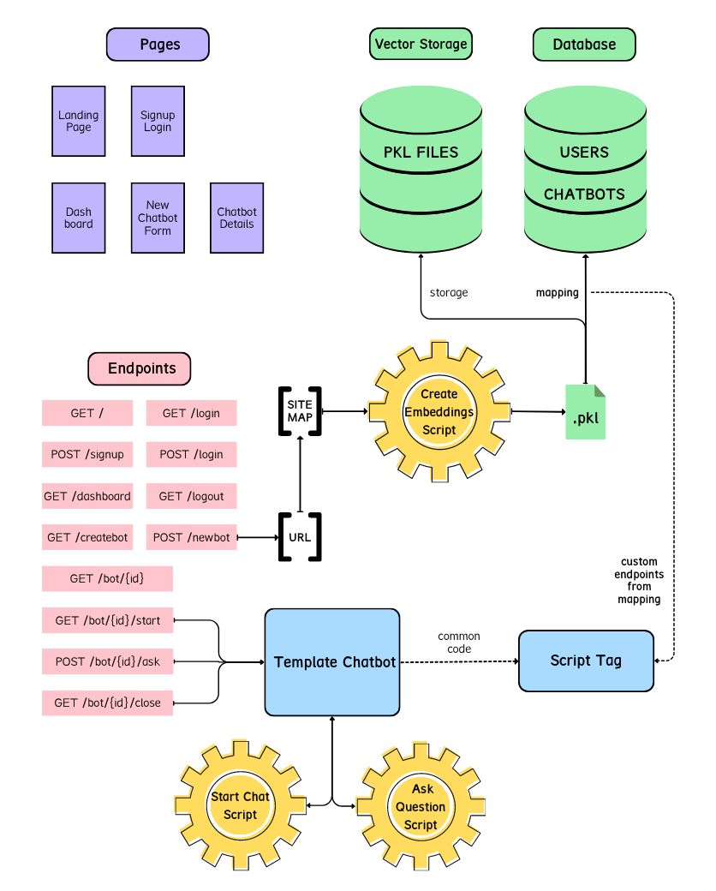

# GPT-Chatbot

A platform to generate gpt-enabled chatbots trained on given web content.

## Design Overview

### Pages
- **Landing page** with introduction, usage details and general information.
- **Signup/Login page** for users.
- **Dashboard page**  to display user's details and the chatbots created by them.
- **New chatbot page** with form to collect required details of new chatbot.
- **Chatbot detail page** to display the information of a chatbot.

### Storage
- **Database** to store User and Chatbot data in JSON format.
- **Vector Storage** to store Pickle files for each chatbot.

### Endpoints
- `GET /` : Serve the Landing page
- `GET /login` : Serve the Login page
- `POST /signup` : Add new user to database
- `POST /login` : Authenticate user and return JWT
- `GET /dashboard` : Serve the Dashboard page
- `GET /logout` : Log the current user out
- `GET /createbot` : Serve the New Chatbot page
- `POST /newbot` : 
  - Generate sitemap from the url provided by user
  - Pass sitemap to `create_embeddings.py` script
  - Store the Pickle file generated in Vector storage
  - Add a new Chatbot to database with mappings to the Pickle File
  - Generate a script tag with Template Chatbot code and the mappings
- `GET /bot/{id}` : Serve the Chatbot detail page
- `GET /bot/{id}/start` : Run the `start_chat_app.py` script with linked Pickle File and store the trained chain object in local memory
- `POST /bot/{id}/ask` : Run the `ask_question.py` script with passed question on the chain object available in memory and return response
- `GET /bot/{id}/close` : Remove the chain object form local memory

### Template Chatbot
- A chat box React component (widget)
- Hits `/bot/{id}/start` endpoint when chatbox is opened
- Hits `/bot/{id}/ask` endpoint when new question is typed and displays response
- Hits `/bot/{id}/close` endpoint when chatbox is closed

## Tech Stack
- Platform Backend : Flask
- Platform Frontend : React
- Template Chatbot : React
- Database : MongoDB
- Vector Storage : TBD

## References
- https://sitegpt.ai/
- https://github.com/mpaepper/content-chatbot
- https://www.paepper.com/blog/posts/build-q-and-a-bot-of-your-website-using-langchain/
